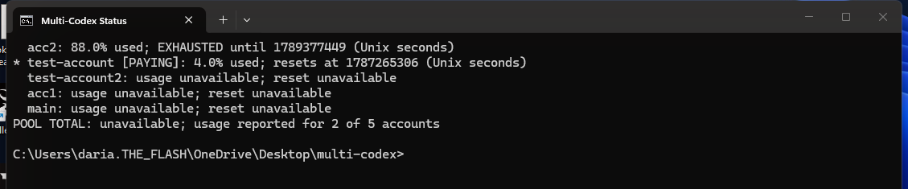
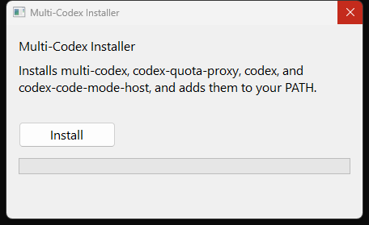

# Multi-Codex

[](LICENSE)
[](https://github.com/DarianBaker/Multi-Codex/releases/latest)
[](https://github.com/DarianBaker/Multi-Codex/releases/latest)
[](https://www.rust-lang.org/)

A fork of [Codex CLI](https://developers.openai.com/codex) with `multi-codex`
added: a tool that pools several Codex/ChatGPT accounts behind one local
proxy, so your usage spreads across all of them instead of draining one
account, with automatic switch-over once an account gets close to its limit.
Codex itself talks to the proxy exactly like it talks to the real backend -
nothing about how you use Codex changes, only which account ends up paying
for each request.

<p align="center">
  
</p>

<p align="center"><em>A real run: <code>acc2</code> hit its limit and the pool automatically switched to <code>test-account</code> - no manual intervention, Codex never noticed.</em></p>

This guide assumes you already know how to use `codex` day to day. It's about
`multi-codex` specifically - the account-pooling layer on top.

## Installation

### Windows: the GUI installer (recommended)

<p align="center">
  
</p>

No git, no Rust, no separate Codex CLI install - nothing to set up first.

1. Download `multi-codex-installer.exe` from the
   [**latest release**](https://github.com/DarianBaker/Multi-Codex/releases/latest).
2. Run it, click **Install**. It copies `multi-codex`, `codex-quota-proxy`,
   `codex` (the CLI itself), and `codex-code-mode-host` (Code Mode) to
   `%LOCALAPPDATA%\multi-codex\bin` and adds that folder to your user `PATH`.
3. Open a new terminal and run `multi-codex login <label>` (or `multi-codex
   setup` for several at once) to add your first account - see the
   [user guide](#user-guide) below.

That's it - everything after install happens on the CLI. See
[`codex-rs/quota-proxy/EPIC12_RESULTS.md`](codex-rs/quota-proxy/EPIC12_RESULTS.md)
for exactly what's been verified about this installer.

### Windows: the console wizard (build from source)

If you'd rather build from source than download a prebuilt `.exe`, two
things need to be on your machine first:

1. **Git**, to get the source. [git-scm.com/downloads](https://git-scm.com/downloads)
   if you don't have it (`git --version` in a terminal to check).
2. **Rust** (which includes `cargo`, the build tool). Install via
   [rustup.rs](https://rustup.rs) - on Windows, run:
   ```powershell
   winget install Rustlang.Rustup
   ```
   or download and run `rustup-init.exe` from that page. Close and reopen
   your terminal afterward, then confirm with `cargo --version`.

Then clone this repo and go into it:

```bash
git clone https://github.com/DarianBaker/Multi-Codex.git
cd Multi-Codex
```

The actual Rust project lives in `codex-rs/` inside that folder - `cd
codex-rs` before running any `cargo` command below.

```bash
cd codex-rs
cargo build --release -p codex-quota-proxy -p codex-cli --bin codex-quota-proxy --bin multi-codex --bin multi-codex-wizard --bin codex
target\release\multi-codex-wizard.exe
```

The first build compiles the full `codex` CLI from source too, which takes a
while (~20 minutes on a typical machine) - that's expected, not stuck.

Building `codex` alongside the other two (not just `multi-codex`) matters:
the wizard bundles it into the install folder too if it finds it, so the
result works even on a machine with **no separately-installed Codex CLI at
all** - nothing extra to install first. Copies everything to a stable
location (`%LOCALAPPDATA%\multi-codex\bin`), adds that folder to your user
`PATH`, and - if you say yes when it asks - runs `multi-codex setup` right
there so you can log into your accounts in the same pass. Safe to re-run any
time (won't duplicate the `PATH` entry). See
[`codex-rs/quota-proxy/EPIC11_RESULTS.md`](codex-rs/quota-proxy/EPIC11_RESULTS.md)
for exactly what's been verified about it.

### By hand

- **Windows:** System Properties → Environment Variables → add
  `...\codex-rs\target\release` to your user `PATH`. Or, in an elevated
  PowerShell:
  ```powershell
  [Environment]::SetEnvironmentVariable("PATH", $env:PATH + ";C:\path\to\codex-rs\target\release", "User")
  ```
- **macOS/Linux:** add to your shell profile (`.bashrc`, `.zshrc`, etc.):
  ```bash
  export PATH="$PATH:/path/to/codex-rs/target/release"
  ```

After that, `multi-codex` works as a bare command everywhere. Until you've
done this, use the full path to the built binary directly.

## User guide

### 1. Add an account

```
multi-codex login <label>
```

Runs the real, normal `codex login` flow - opens your browser (or prints a
URL to open yourself on a headless machine):

```
Starting local login server on http://localhost:1455.
If your browser did not open, navigate to this URL to authenticate:

https://auth.openai.com/oauth/authorize?...

On a remote or headless machine? Use `codex login --device-auth` instead.
```

Once you finish logging in:

```
account 'test-account' saved to C:\Users\...\.multi-codex\pool.toml
```

Add `--main` for your regular, everyday account - used only as a last-resort
fallback once every other account is exhausted:

```
multi-codex login daily --main
```

Repeat for each account you want in the pool. `<label>` may only contain
letters, digits, `_` and `-`.

### 2. Or add several at once: the setup wizard

```
multi-codex setup
```

```
Account label (blank to finish): test-account
Is this the main fallback account? [y/N]: n
...
Account label (blank to finish): daily
Is this the main fallback account? [y/N]: y
...
Account label (blank to finish):
setup finished; run `multi-codex accounts` to review.
```

Leave the label blank to stop. Each account goes through the same real login
flow as step 1 - the wizard is just a loop around it.

### 3. Check what's configured

```
multi-codex accounts
```

```
'test-account': priority=0
'test-account2': priority=1
```

Lower priority numbers are tried first, and `(main)` marks the fallback
account. This is recomputed automatically every time you `login`/`setup`.

### 4. Use it

```
multi-codex
```

No arguments. Starts the pool as a separate background process (so its own
logging never interferes with Codex's display - see `~/.multi-codex/proxy.log`
if something seems off) and launches a real, interactive Codex session already
wired up to it - use it exactly like plain `codex`. Exit however you normally
would; the pool shuts down when Codex exits.

### 5. See who's paying and how much is used

```
multi-codex status
```

```
* test-account [PAYING]: 0.0% used; resets at 1787265306 (Unix seconds)
  test-account2: usage unavailable; reset unavailable
POOL TOTAL: unavailable; usage reported for 1 of 2 accounts
```

The `*`/`[PAYING]` marker moves as the pool switches accounts. "usage
unavailable" just means that account hasn't handled a request yet - expected,
not an error.

### 6. After every Codex upgrade

```
multi-codex selfcheck
```

Checks redirection, account swapping, and usage reading against a throwaway
copy of your real pool, in under a minute, and states exactly which part
broke, if any. Codex forks change their internal request shape without
notice; this is the fast way to catch it before you notice mid-task.

## More detail

- [**Full command reference**](codex-rs/quota-proxy/MULTI_CODEX.md) - every
  subcommand (`check`, what's out of scope today, etc.) with real observed
  output for each.
- [**Manual setup**](codex-rs/quota-proxy/SETUP.md) - the fully hand-driven
  path (hand-written settings file, separate proxy process, `config.toml`
  editing), if you'd rather not use `multi-codex` itself.
- [**Real-run proof**](codex-rs/quota-proxy/EPIC9_RESULTS.md) that the pool
  actually bills the right account, survives a mid-conversation switch, and
  doesn't break skills or plugins - plus
  [proof for `multi-codex` itself](codex-rs/quota-proxy/EPIC10_RESULTS.md)
  (real login, real interactive session, the setup wizard).
- [**Codex CLI's own documentation**](https://developers.openai.com/codex) -
  for everything about using `codex` day to day that isn't specific to the
  account pool.

This repository is licensed under the [Apache-2.0 License](LICENSE).
